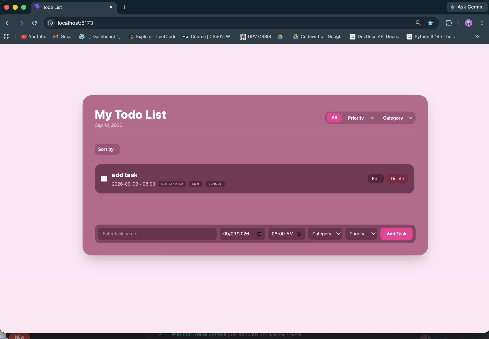
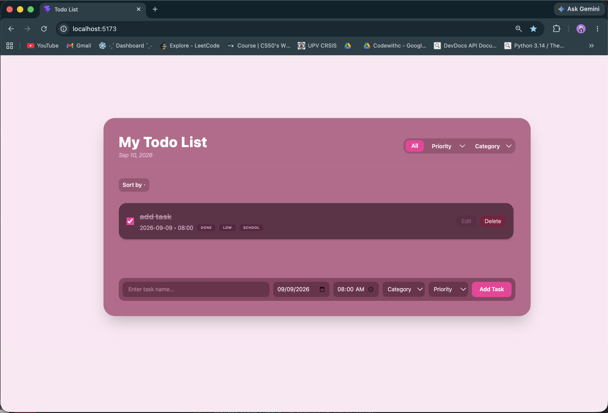
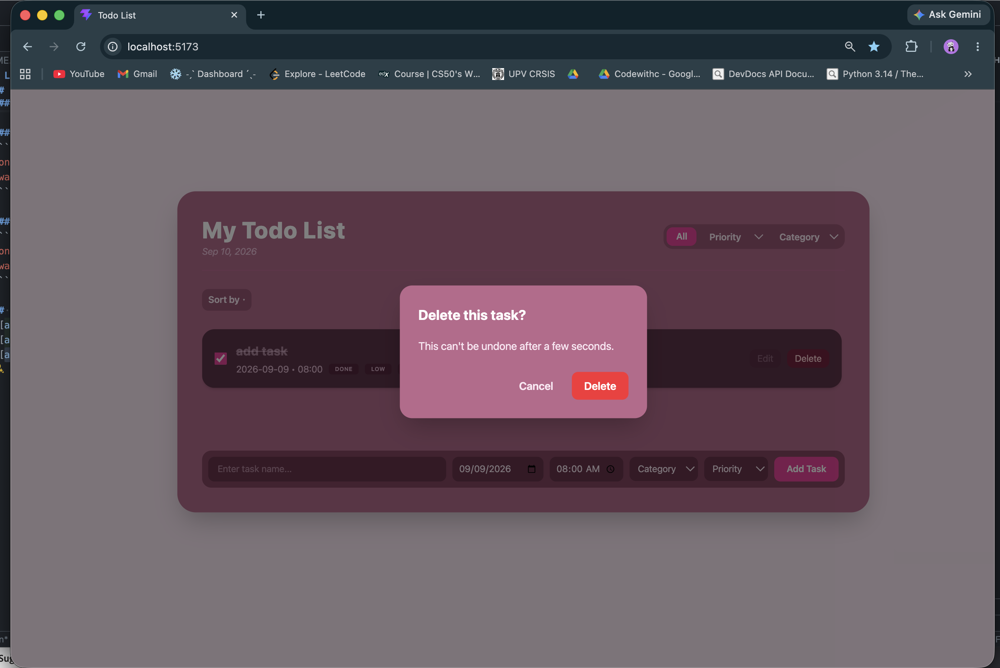
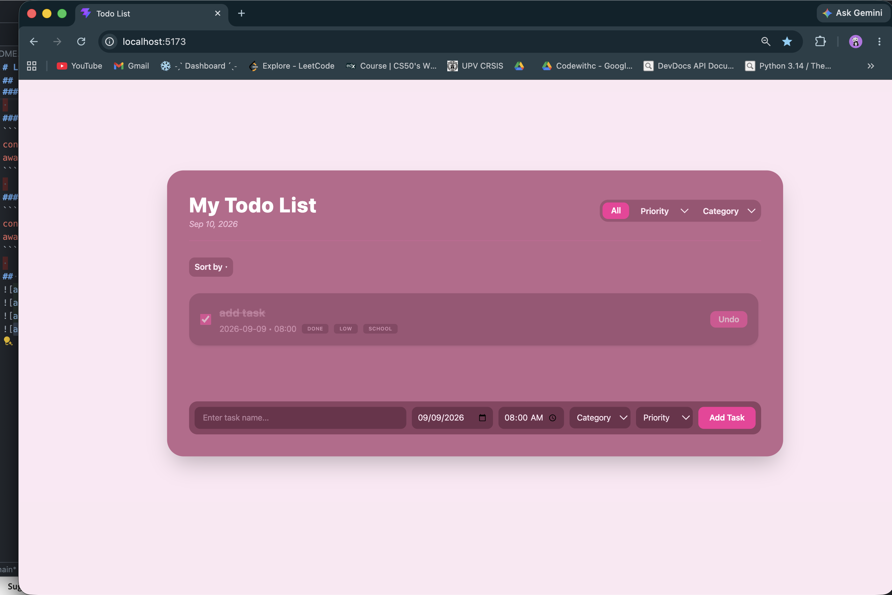
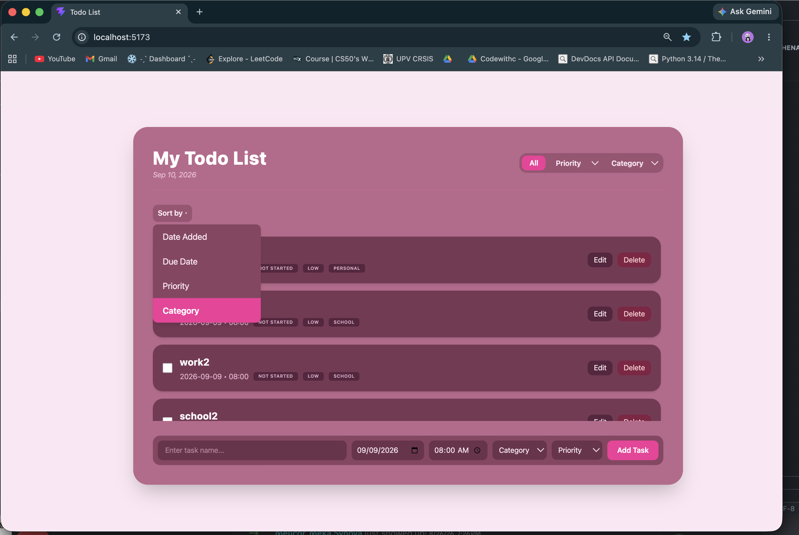
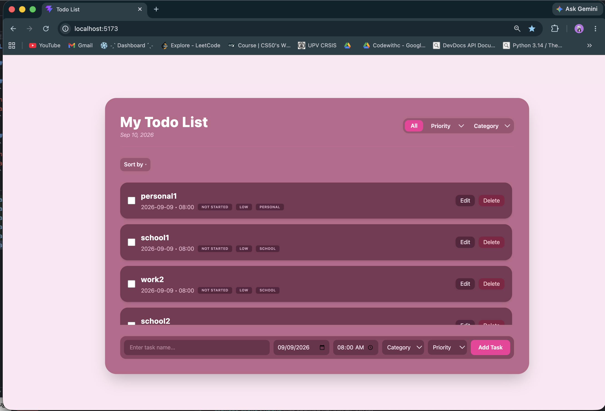
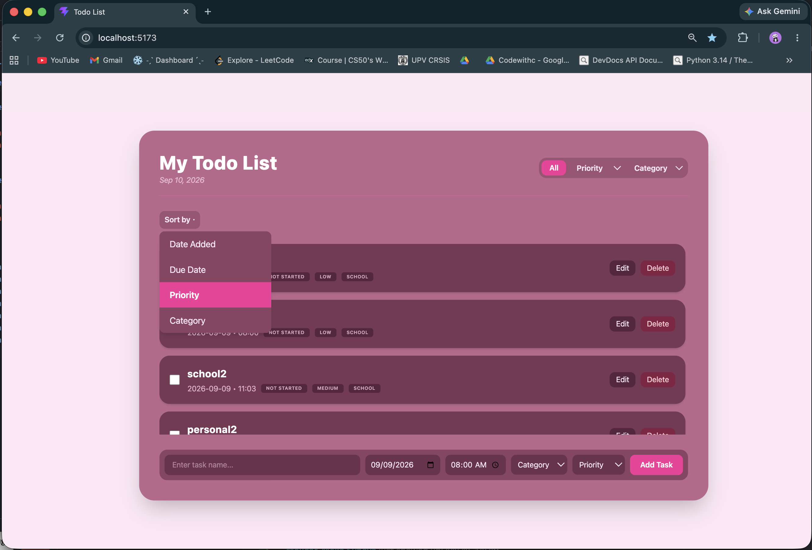

 
A todo list app with full CRUD functionality, built for CMSC128 Lab 1 by Trisha Mae Hechenagocia & Aleighia Keith Reyes.


## Features
 
- Create, read, update, and delete tasks
- Delete includes a 5-second "Undo" window before the task is permanently removed
- Mark tasks as done via checkbox (strikethrough + color change)
- Sort tasks by Date Added, Due Date, Priority, or Category
- Filter tasks by Category or Priority
- Data persistence via Firestore


## Tech Stack


**Frontend:** React (Vite) + Tailwind CSS
 
We chose Vite for fast dev-server startup and hot module reload during development, and React for its component model, which made it straightforward to split the app into reusable pieces that could be built and merged independently by both partners.
 
**Backend / Database:** Firebase (Firestore + Authentication)
 
Rather than building a separate Express/Node REST API, we used Firebase's client SDK to talk to Firestore directly from React. We chose this over a custom Express backend because:
- Firestore's `onSnapshot` listeners give us real-time updates for free — task changes reflect instantly across the UI without manual polling or refetching.
- No server to host or maintain, Firestore's security rules handle access control directly, which was a better fit for the timeline of this lab.


## Running the App Locally
 
### Prerequisites
- [Node.js](https://nodejs.org/) (v18 or later recommended)
- npm (comes with Node.js)
- A Firebase project with Firestore and Anonymous Authentication enabled
### Setup
 
1. **Clone the repo**
```bash
   git clone https://github.com/rite-rash/cmsc128-Lab1_CRUD_Hechenagocia_Reyes.git
   cd cmsc128-Lab1_CRUD_Hechenagocia_Reyes/client
```
 
2. **Install dependencies**
```bash
   npm install
```
 
3. **Set up Firebase config**
   Create a `firebaseConfig.js` file inside `src/` (if not already present) with your own Firebase project credentials:
```js
   import { initializeApp } from "firebase/app";
   import { getAuth } from "firebase/auth";
   import { getFirestore } from "firebase/firestore";
 
   const firebaseConfig = {
     apiKey: "YOUR_API_KEY",
     authDomain: "YOUR_PROJECT.firebaseapp.com",
     projectId: "YOUR_PROJECT_ID",
     storageBucket: "YOUR_PROJECT.appspot.com",
     messagingSenderId: "YOUR_SENDER_ID",
     appId: "YOUR_APP_ID",
   };
 
   const app = initializeApp(firebaseConfig);
   export const auth = getAuth(app);
   export const db = getFirestore(app);
```
 
   In the [Firebase Console](https://console.firebase.google.com/):
   - Enable **Firestore Database**
   - Enable **Authentication → Sign-in method → Anonymous**
4. **Run the dev server**
```bash
   npm run dev
```
   The app will be available at `http://localhost:5173` by default.
 
5. **Build for production** (optional)
```bash
   npm run build
```
 
## Data Operations (Firestore CRUD)
 
Since there's no REST API layer, all CRUD operations happen via the Firestore SDK directly in `App.jsx`. Here's what each operation looks like:
 
### Create — Add a new task
```js
await addDoc(collection(db, "tasks"), {
  taskName: "Finish lab report",
  dueDate: "2026-09-15",
  dueTime: "23:59",
  status: "not started",
  priority: "high",
  category: "school",
  userId: user.uid,
  createdAt: serverTimestamp(),
});
```
 
### Read — Listen for a user's tasks in real time
```js
const q = query(collection(db, "tasks"), where("userId", "==", user.uid));
 
onSnapshot(q, (snapshot) => {
  const tasks = snapshot.docs.map((doc) => ({ id: doc.id, ...doc.data() }));
  // tasks state updates automatically whenever Firestore data changes
});
```
 
### Update — Edit a task or toggle its status
```js
const taskRef = doc(db, "tasks", taskId);
await updateDoc(taskRef, { status: "done" });
```
 
### Delete — Remove a task
```js
const taskRef = doc(db, "tasks", taskId);
await deleteDoc(taskRef);
```
 
## Screenshots









